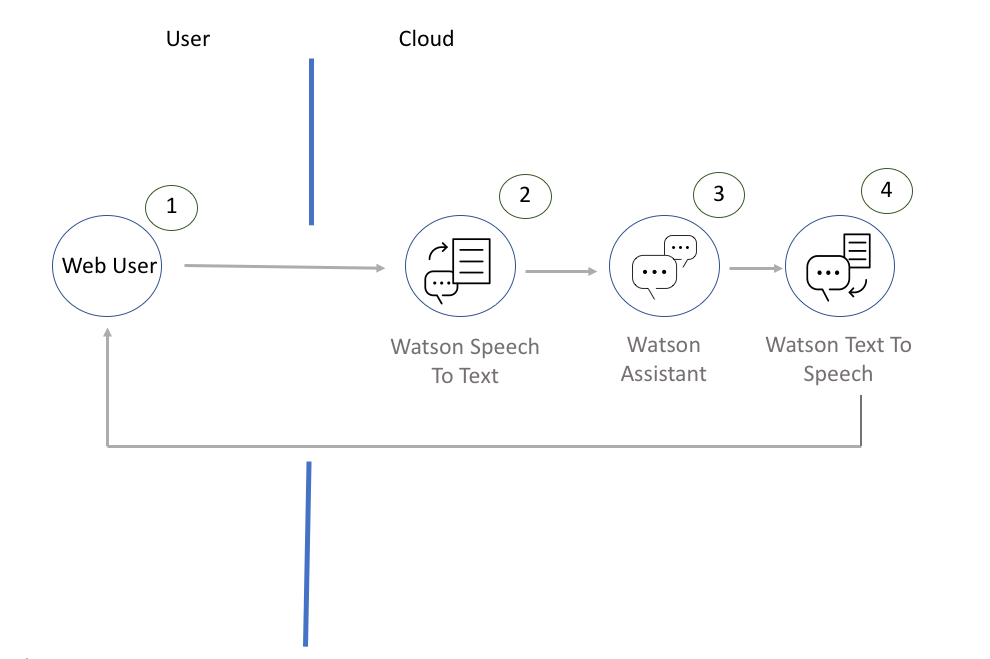
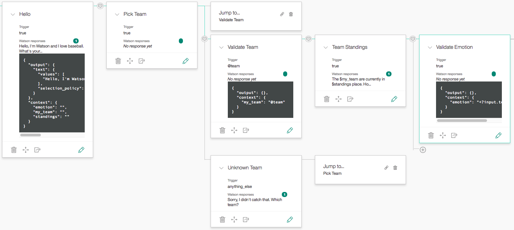

<!--Put badges at the very top -->
<!--change the repo -->
[](https://travis-ci.org/IBM/watson-banking-chatbot)
<!--Add a new Title and fill in the blanks -->
# Watson Voice BOT
In this Code Pattern, we will create a Voice BOT ie. a Web based Chat Bot activated with voice using Watson Speech To Text, Watson Text To Speech, Watson Assistant built on top of JQuery and Python Flask.
In this pattern the chat bot is activated using a voice input and the response is also received as an Audio input. The input and response is also shown on the screen in text format for user verification.


When the reader has completed this Code Pattern, they will understand how to:

* Make a Watson Speech To Text Call using Web Socket Connection
* Make a Watson Text to Speech REST API call
* Send and receive messages to Watson Assistant using REST APIs
* Integrate Watson Speech To Text, Watson Text To Speech and Watson Assistant into a Voice BOT

<!--Remember to dump an image in this path-->


## Flow
<!--Add new flow steps based on the architecture diagram-->
1. User gives Audio Input through the browser
2. The Audio Input is passed onto Watson Speech To Text using a Web Socket connection
3. The text from Watson Speech to Text is extracted and sent as input to Watson Assistant.
4. The response from Watson Assistant is passed onto Watson Text to Speech and the audio output is given to the user.
5. The UI also displays the text corresponding to the dialog happening in audio format.

<!--Update this section-->
## Included components
* [Watson Speech-to-Text](https://www.ibm.com/watson/developercloud/speech-to-text.html):  A service that converts human voice into written text.
* [Watson Text-to-Speech](https://www.ibm.com/watson/services/text-to-speech/): Converts written text into natural sounding audio in a variety of languages and voices.
* [Watson Assistant](https://www.ibm.com/watson/services/conversation/): Create a chatbot with a program that conducts a conversation via auditory or textual methods.

<!--Update this section-->
## Featured technologies
Select components from [here](https://github.ibm.com/developer-journeys/journey-docs/tree/master/_content/dev#technologies), copy and paste the raw text for ease
* [Flask](http://flask.pocoo.org/): Python is a programming language that lets you work more quickly and integrate your systems more effectively.
* [jQuery](https://jquery.com/): It is a cross-platform JavaScript library designed to simplify the client-side scripting of HTML.

<!--Update this section when the video is created-->
# Watch the Video
[](https://www.youtube.com/watch?v=Jxi7U7VOMYg)

# Steps
Use the ``Deploy to IBM Cloud`` button **OR** create the services and run locally.

## Deploy to IBM Cloud
<!--Update the repo and tracking id-->
[](https://bluemix.net/deploy?repository=https://github.com/ptrikkur/CodePattern_VoiceBot.git)

#### 1. Press the above ``Deploy to IBM Cloud`` button and then click on ``Deploy``.

<!--optional step-->
#### 2. In Toolchains, click on Delivery Pipeline to watch while the app is deployed. Once deployed, the app can be viewed by clicking 'View app'.


<!--update with service names from manifest.yml-->
#### 3. To see the app and services created and configured for this Code Pattern, use the IBM Cloud dashboard. The app is named `watson-voice-bot` with a unique suffix. The following services are created and easily identified by the `wvb-` prefix:
    * wvb-speechtotext
    * wvb-texttospeech
    * wvb-assistant

#### 4. Import Conversation Workspace
  Follow Step [Import the Conversation workspace](#3-import-the-conversation-workspace) under the Section `Run Locally`


#### 5. Configure Environment Variable
  Open the app starting with the name `CodePattern_VoiceBot from under the [IBM Cloud Dashboard](https://console.bluemix.net/dashboard/apps/) by clicking on the Application name.

  Click on `Runtime` on the left nav.

  Select the `Environment Variables` tab.

  Scroll down and click on `Add`.

  

  Specify the Enviroment variable name as `WORKSPACEID and insert the Workspace Id of the Conversation workspace created in Step 4.

  Click Save and wait for the application to reload.

## Run locally
> NOTE: These steps are only needed when running locally instead of using the ``Deploy to IBM Cloud`` button.

<!-- there are MANY updates necessary here, just screenshots where appropriate -->

1. [Clone the repo](#1-clone-the-repo)
2. [Create Watson services with IBM Cloud](#2-create-watson-services-with-ibm-cloud)
3. [Import the Conversation workspace](#3-import-the-conversation-workspace)
4. [Configure credentials](#4-configure-credentials)
5. [Run the application](#5-run-the-application)

### 1. Clone the repo

Clone the `watson-voice-bot` locally. In a terminal, run:

```
$ git clone https://github.com/IBM/watson-voice-bot
```

We’ll be using the file [`data/conversation/assistant/voicebot.json`](data/aassistant/workspaces/voicebot.json) and the folder
[`data/assistant/workspaces/`](data/assistant/workspaces/)

### 2. Create Watson services with IBM Cloud

Create the following services:

* [**Watson Conversation**](https://console.ng.bluemix.net/catalog/services/conversation)
* [**Watson Speech To Text**](https://console.bluemix.net/catalog/services/speech-to-text)
* [**Watson Text To Speech**](https://console.bluemix.net/catalog/services/text-to-speech)


### 3. Import the Conversation workspace

Launch the **Watson Assistant** tool. Use the **import** icon button on the right

Find the local version of [`data/assistant/workspaces/voicebot.json`](data/assistant/workspaces/voicebot.json) and select
**Import**. Find the **Workspace ID** by clicking on the context menu of the new
workspace and select **View details**. Save this ID for later.

*Optionally*, to view the conversation dialog select the workspace and choose the
**Dialog** tab, here's a snippet of the dialog:



If running the application using the toolchain then continue back with Step 5 in the previous section [Configuring Environment variables ](#5-configure-environment-variable)
else move on to Step 4 below.


### 4. Configure credentials

The credentials for IBM Cloud services (Assistant, Speech To Text and Text To Speech), can be found in the ``Services`` menu in IBM Cloud,
by selecting the ``Service Credentials`` option for each service.

The other settings for Conversation was collected during the
earlier setup step (``WORKSPACE_ID``).

Copy the [`env.sample`](env.sample) to `.env`.

```
$ cp env.sample .env
```
Edit the `.env` file with the necessary settings.

#### `env.sample:`

```
# Replace the credentials here with your own.
# Rename this file to .env before starting the app.

# Watson conversation
CONVERSATION_USERNAME=<add_conversation_username>
CONVERSATION_PASSWORD=<add_conversation_password>
WORKSPACE_ID=<add_conversation_workspace>

# Watson Speech To Text
STT_USERNAME=<add_stt_username>
STT_PASSWORD=<add stt password>

# Watson Text To SpeechToText
TTS_USERNAME=<add tts username>
TTS_PASSWORD=<add tts password>

# Run locally on a non-default port (default is 5000)
# PORT=5000

```

### 5. Run the application
1. Install [Python](https://www.python.org/) runtime. Note that you will need version 3.6 or higher.
2. Start the app by running `python welcome.py`
3. Use the chatbot at `localhost:5000`.
4. Click on the mic icon to speak and click again once you are done speaking to record you speech.
> Note: server host can be changed as required in server.js and `PORT` can be set in `.env`.

<!--Add a section that explains to the reader what typical output looks like, include screenshots -->

# Sample output

Follow the script under ``ScriptForVoiceBOT.docx`` for best results. Alternatively you can configure your own dialog under Watson Assistant.


<!--Include any troubleshooting tips (driver issues, etc)-->

# Troubleshooting

* Error: Environment {GUID} is still not active, retry once status is active

  > This is common during the first run. The app tries to start before the Discovery
environment is fully created. Allow a minute or two to pass. The environment should
be usable on restart. If you used `Deploy to IBM Cloud` the restart should be automatic.

* Error: Only one free environent is allowed per organization

  > To work with a free trial, a small free Discovery environment is created. If you already have
a Discovery environment, this will fail. If you are not using Discovery, check for an old
service thay you may want to delete. Otherwise use the .env DISCOVERY_ENVIRONMENT_ID to tell
the app which environment you want it to use. A collection will be created in this environment
using the default configuration.

<!--Include any relevant links-->

# Links
* [Demo on Youtube](https://www.youtube.com/watch?v=Jxi7U7VOMYg)
* [Watson Node.js SDK](https://github.com/watson-developer-cloud/node-sdk)
* [Relevancy Training Demo Video](https://www.youtube.com/watch?v=8BiuQKPQZJk)
* [Relevancy Training Demo Notebook](https://github.com/akmnua/relevancy_passage_bww)

<!-- pick the relevant ones from below -->
# Learn more

* **Artificial Intelligence Code Patterns**: Enjoyed this Code Pattern? Check out our other [AI Code Patterns](https://developer.ibm.com/code/technologies/artificial-intelligence/).
* **Data Analytics Code Patterns**: Enjoyed this Code Pattern? Check out our other [Data Analytics Code Patterns](https://developer.ibm.com/code/technologies/data-science/)
* **AI and Data Code Pattern Playlist**: Bookmark our [playlist](https://www.youtube.com/playlist?list=PLzUbsvIyrNfknNewObx5N7uGZ5FKH0Fde) with all of our Code Pattern videos
* **With Watson**: Want to take your Watson app to the next level? Looking to utilize Watson Brand assets? [Join the With Watson program](https://www.ibm.com/watson/with-watson/) to leverage exclusive brand, marketing, and tech resources to amplify and accelerate your Watson embedded commercial solution.
* **Data Science Experience**: Master the art of data science with IBM's [Data Science Experience](https://datascience.ibm.com/)
* **PowerAI**: Get started or get scaling, faster, with a software distribution for machine learning running on the Enterprise Platform for AI: [IBM Power Systems](https://www.ibm.com/ms-en/marketplace/deep-learning-platform)
* **Spark on IBM Cloud**: Need a Spark cluster? Create up to 30 Spark executors on IBM Cloud with our [Spark service](https://console.bluemix.net/catalog/services/apache-spark)
* **Kubernetes on IBM Cloud**: Deliver your apps with the combined the power of [Kubernetes and Docker on IBM Cloud](https://www.ibm.com/cloud-computing/bluemix/containers)

<!--keep this-->

# License
[Apache 2.0](LICENSE)
